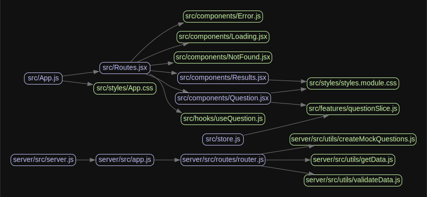

## React Training Test

React Training Test is a web application built with React that does the following:
presents a user with an option, then the user is given another question. When the user picks an option from the question, they are shown another question with more options. This is repeated until the final option is selected, then an answer (the last selected option) is displayed.

### Technologies used

- Create React App
- npm - package manager
- Redux - state management
- React Router - navigation
- CSS Modules - styling
- Jest & Testing Library - tests
- Express - API Server
- Ajv - Data validation

## Installation

### Prerequisites

- Node.js (v18)
  - nodemon - `npm install -g nodemon`

### Steps

1. Clone the repository:

```bash
git clone https://github.com/kidby/react-training-test.git
```

2. Navigate to the project directory:

```bash
cd react-training-test
```

3. Install the required dependencies:

```bash
npm install
```

4. (optional) Create a `.env` file in the root directory and set the `REACT_APP_SERVER_PORT` for the Server Port and `PORT` for the React App

```bash
REACT_APP_SERVER_PORT='5555'
PORT='3000'
```

5. Start the server and app:

```bash
npm start
```

The application should now be running on `http://localhost:3000`.

### Usage

1. Run `npm start` to run a question flow or `npm run dev:test` to run the mocked data
2. Start the question flow by clicking on the first question's option.
3. Navigate through the questions by clicking on the available options.
4. After answering the last question, you will be redirected to the results page displaying your last answer.
5. Retake the question flow by clicking the "Start Over" button.

### Design

#### Dependency Map



#### Directory Structure

```text
react-training-test/
├── public/
│   ├── favicon.ico
│   ├── index.html
│   ├── manifest.json
│   └── robots.txt
│
├── server/
│   ├── package.json
│   ├── README.md
│   └── src/
│       ├── data/
│       │    ├── questions.json
│       │    └── questionsSchema.json
│       ├── routes/
│       │    └── router.js
│       ├── utils/
│       │    ├── createMockQuestions.js
│       │    ├── getData.js
│       │    └── validateData.js
│       ├── app.js
│       └── server.js
│
├── src/
│   ├── components/
│   │   ├── Error.jsx, Error.test.js
│   │   ├── ErrorBoundary.jsx
│   │   ├── Loading.jsx, Loading.test.js
│   │   ├── Question.jsx, Question.test.js
│   │   └── Results.jsx, Results.test.js
│   │
│   ├── features/
│   │   ├── index.js
│   │   └── questionSlice.js
│   │
│   ├── hooks/
│   │   └── useQuestion.js
│   │
│   ├── styles/
│   │   ├── App.css
│   │   ├── index.css
│   │   └── styles.module.css
│   │
│   ├── App.jsx
│   ├── index.jsx
│   ├── Routes.jsx
│   └── store.js
│
├── .env
├── .eslintignore
├── .eslintrc
├── .gitignore
├── .nvmrc
├── jest.config.js
├── package.json
├── npm-lock.yaml
├── npm-workspace.yaml
└── README.md

```
